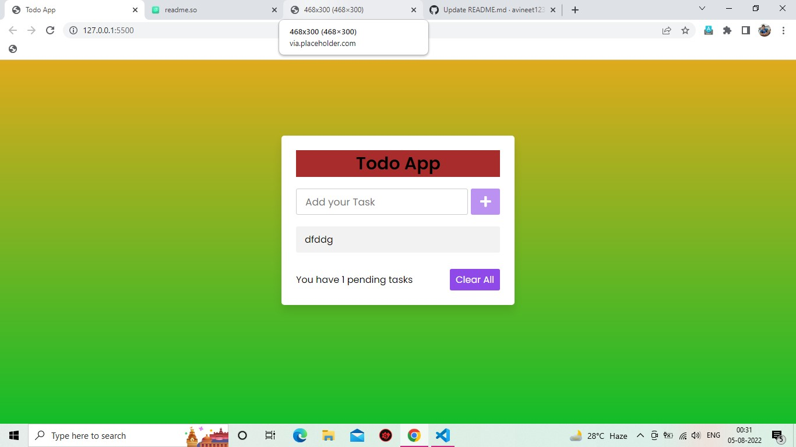
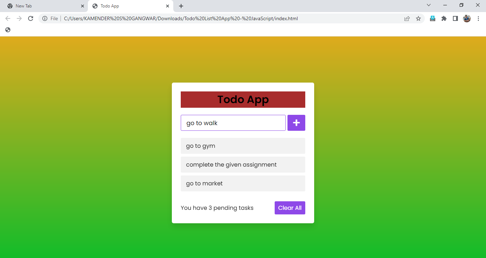
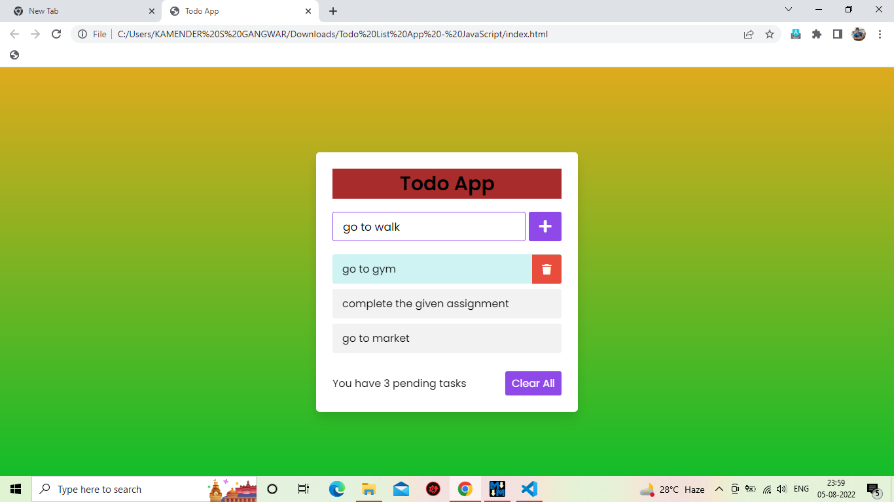
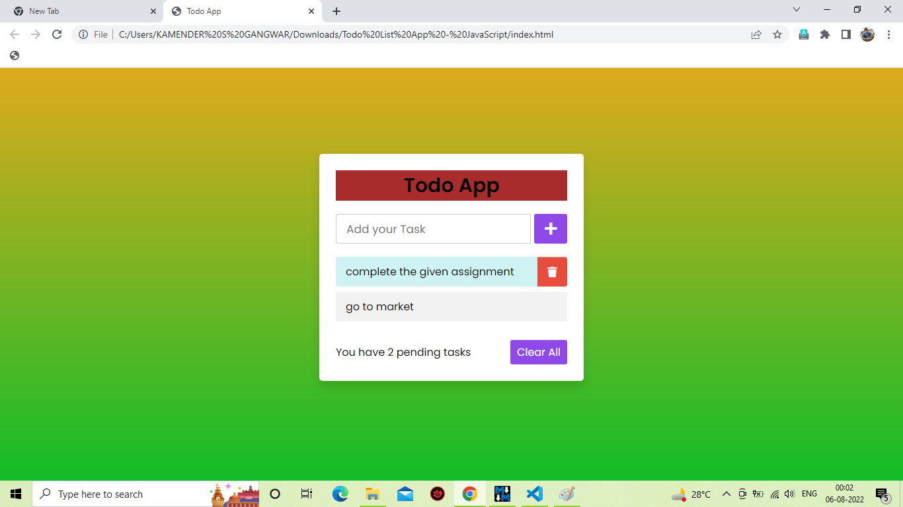
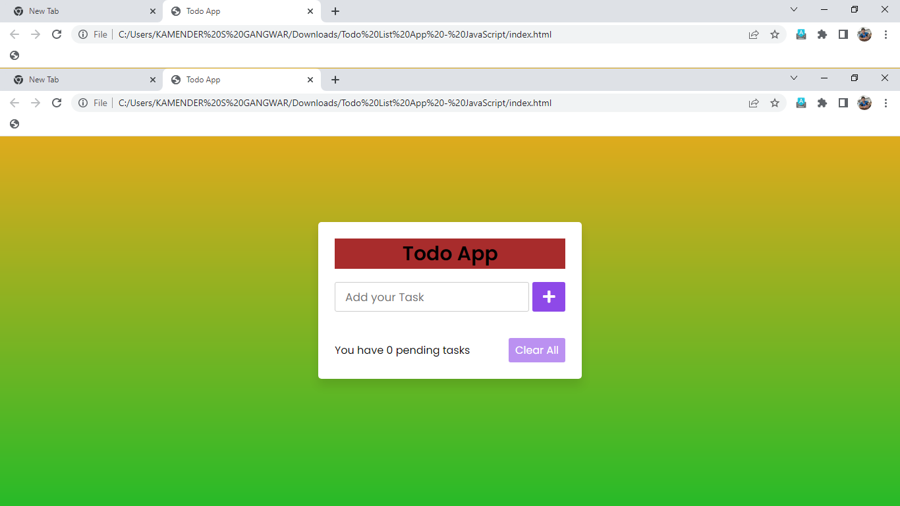

#Todo List App

A user may add to todo task list, view all  the tasks they have to complete,if the task is completed then just click on that task after clicking it will show as completed and the completed task can be deleted by "Delete  Button".

# Acknowledgment
This project is made as a assessment while learning Front end Development as Coding Ninjas.

# Author
This Project is created by Kamender singh Gangwar.
## Tech Stack

 HTML, CSS, JAVASCRIPT

## Screenshots

Add a Task Screenshot

Select a Task Screenshot

Delete a Task Screenshot.

Clear All Task Screenshot.

